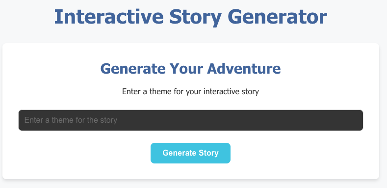
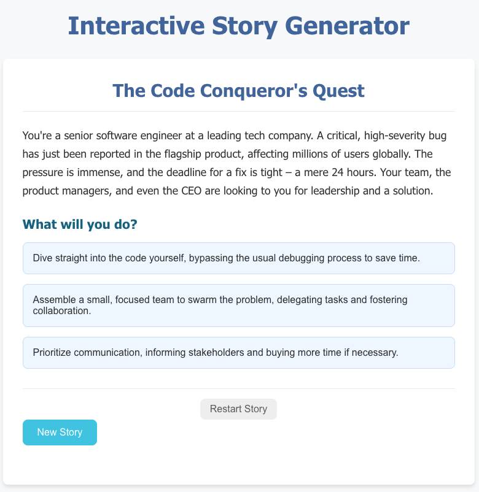
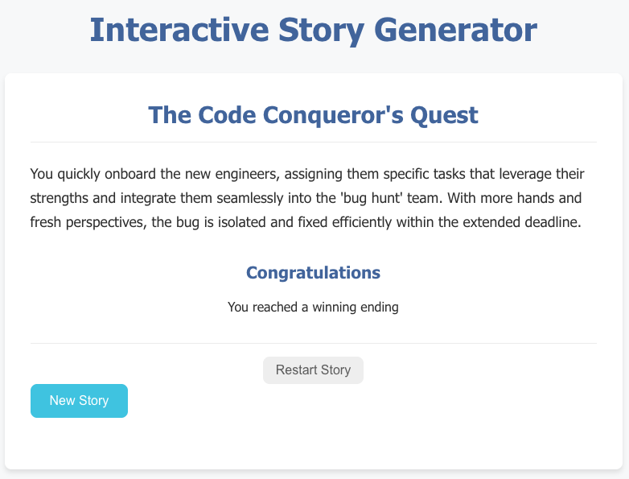

# Interactive Story Generator

An interactive web application that generates dynamic, branching stories using AI. Users can input a theme, and the application creates a personalized story with multiple choices that lead to different narrative branches and outcomes.

## Features

- **AI-Powered Story Generation**: Uses Google's Generative AI (Gemini) to create unique stories
- **Interactive Branching Narratives**: Stories have multiple choice points that lead to different outcomes
- **Session Management**: Tracks user sessions with cookies for a personalized experience
- **Background Task Processing**: Story generation happens asynchronously to prevent blocking the UI
- **Real-time Status Tracking**: Frontend polls backend to check story generation progress
- **Winning/Losing Endings**: Stories can have multiple ending types with different outcomes

### Interface Preview

**Story Creation**


**Interactive Story with Choices**


**Story Completion**


## Project Architecture

```
practice/
├── backend/                 # FastAPI backend server
│   ├── main.py             # Entry point, initializes FastAPI app
│   ├── core/
│   │   ├── config.py       # Configuration management
│   │   ├── story_generator.py  # AI story generation logic
│   │   └── prompts.py      # LLM prompts
│   ├── db/
│   │   └── database.py     # SQLAlchemy setup, database configuration
│   ├── models/             # SQLAlchemy ORM models
│   │   ├── story.py        # Story and StoryNode models
│   │   └── job.py          # StoryJob model for tracking generation
│   ├── routers/            # API endpoints
│   │   ├── story.py        # Story creation and retrieval endpoints
│   │   └── job.py          # Job status endpoints
│   ├── schemas/            # Pydantic request/response models
│   │   ├── story.py        # Story schemas
│   │   └── job.py          # Job schemas
│   └── pyproject.toml      # Python dependencies
│
└── frontend/               # React frontend application
    ├── src/
    │   ├── main.jsx        # React entry point
    │   ├── App.jsx         # Root component with routing
    │   ├── util.js         # API base URL configuration
    │   └── components/
    │       ├── StoryGenerator.jsx  # Main form to create stories
    │       ├── StoryLoader.jsx     # Fetches story from backend
    │       ├── StoryGame.jsx       # Interactive story display and navigation
    │       ├── ThemeInput.jsx      # Input form for story theme
    │       └── LoadingStatus.jsx   # Loading indicator
    ├── vite.config.js      # Vite configuration with API proxy
    ├── .env                # Environment variables
    └── package.json        # Node dependencies
```

## Tech Stack

### Backend
- **Framework**: FastAPI (Python web framework)
- **Database**: SQLite with SQLAlchemy ORM
- **AI**: Google Generative AI (Gemini)
- **Async Tasks**: Background tasks for story generation
- **Validation**: Pydantic for data validation and serialization

### Frontend
- **Framework**: React 18
- **Build Tool**: Vite
- **HTTP Client**: Axios
- **Routing**: React Router
- **Styling**: CSS

## Setup Instructions

### Prerequisites
- Python 3.10+
- Node.js 16+
- `uv` package manager (recommended) or `pip`

### Backend Setup

1. **Navigate to backend directory**
   ```bash
   cd practice/backend
   ```

2. **Create and activate virtual environment** (if using uv)
   ```bash
   uv venv
   source .venv/bin/activate  # On Windows: .venv\Scripts\activate
   ```

3. **Install dependencies**
   ```bash
   uv pip install -r pyproject.toml
   # Or with pip:
   pip install -e .
   ```

4. **Set up environment variables**
   Create a `.env` file in `backend/`:
   ```
   DATABASE_URL=sqlite:///./stories.db
   GOOGLE_API_KEY=your_google_api_key_here
   ```

5. **Run the backend**
   ```bash
   python main.py
   ```
   The backend will start on `http://localhost:8000`

### Frontend Setup

1. **Navigate to frontend directory**
   ```bash
   cd practice/frontend
   ```

2. **Install dependencies**
   ```bash
   npm install
   ```

3. **Environment configuration**
   The `.env` file already has `VITE_DEBUG=true` configured. This enables the Vite proxy that forwards API requests to the backend.

4. **Run the frontend**
   ```bash
   npm run dev
   ```
   The frontend will start on `http://localhost:5173`

## Running the Application

1. **Start the backend** (Terminal 1)
   ```bash
   cd practice/backend
   uv run main.py
   ```

2. **Start the frontend** (Terminal 2)
   ```bash
   cd practice/frontend
   npm run dev
   ```

3. **Open your browser**
   Navigate to `http://localhost:5173`

## How It Works

### User Flow

1. **User enters a story theme** (e.g., "underwater adventure")
2. **Frontend sends request** to `/api/stories/create` endpoint
3. **Backend creates a job** and immediately returns a job ID
4. **Frontend polls** `/api/jobs/{job_id}` to check generation status
5. **Backend generates story** in background using AI
6. **Once complete**, frontend fetches the full story from `/api/stories/{story_id}/complete`
7. **User plays the story** by choosing options that branch to different narrative paths

### Story Generation Process

1. **Prompt Creation**: Story theme is formatted into a structured prompt for the LLM
2. **AI Response**: Gemini generates a story as JSON with nested node structure
3. **Parsing**: PydanticOutputParser validates and converts JSON to Python objects
4. **Database Storage**: Story nodes are recursively saved to the database
5. **Job Tracking**: Job status is updated from "pending" → "processing" → "completed"

## Expected Results

When you generate a story with theme "underwater adventure", you should see:

1. **Story Title**: An AI-generated title (e.g., "The Azure Depths: A Hydro-Adventure")

2. **Initial Story Node**: A narrative paragraph setting the scene (e.g., "You are a marine explorer tasked with investigating a newly discovered trench...")

3. **Multiple Choice Options**: Interactive buttons showing different paths (e.g., "Descend cautiously", "Activate floodlights", "Deploy a drone")

4. **Branching Narrative**: Clicking each option leads to different story branches with unique content

5. **Endings**: Some paths lead to:
   - **Winning endings**: "Congratulations! You reached a winning ending"
   - **Regular endings**: "The End. Your adventure has ended."

6. **Controls**:
   - "Restart Story": Reset to the beginning
   - "New Story": Generate a different story

## Key Components Explained

### Backend Components

- **StoryGenerator**: Orchestrates AI story generation with recursive node processing
- **SessionManager**: Creates and tracks user sessions via cookies
- **BackgroundTasks**: Handles long-running story generation asynchronously
- **Database Models**: Story, StoryNode, and StoryJob track all data

### Frontend Components

- **StoryGenerator**: Main component managing story creation and job polling
- **StoryGame**: Interactive display of story with choice navigation
- **StoryLoader**: Fetches story data from backend API

## Common Issues & Solutions

### Issue: API 404 Errors
**Solution**: Ensure Vite proxy is enabled by checking:
1. `.env` has `VITE_DEBUG=true` (lowercase)
2. Restart frontend dev server after changing `.env`
3. Backend is running on port 8000

### Issue: "No module named 'langchain_google_genai'"
**Solution**: Install using `uv pip install langchain-google-genai`

### Issue: Google API rate limiting (429 error)
**Solution**: 
- Set up billing in Google Cloud Console
- Or wait 60 seconds before trying again

### Issue: Story generation takes too long
**Solution**: This is expected behavior. Story generation with AI can take 10-30 seconds. The frontend shows a loading status while waiting.

## Development Notes

### Adding New Features

1. **New Story Attributes**: Update `StoryNode` model in `models/story.py`
2. **New API Endpoints**: Add routes in `routers/story.py`
3. **New UI Components**: Create React components in `frontend/src/components/`
4. **Styling**: Update CSS files in the frontend

### Testing the API

Use the interactive API docs at `http://localhost:8000/docs` (auto-generated by FastAPI)

## Future Enhancements

- [ ] User authentication and persistent story history
- [ ] Story branching visualization (tree diagram)
- [ ] Difficulty levels and content filtering
- [ ] Story sharing and leaderboards
- [ ] Multiple language support
- [ ] Custom AI model selection

## License

This project is for educational purposes as part of software engineer technical interview preparation.

---

**Happy story exploring! **
